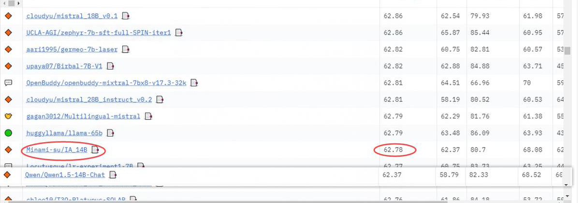

## News
[2024-06-06]Releases the toxic-sft-zh code and datasets.[toxic-Instruction](https://github.com/Minami-su/character_AI_open/tree/main/toxic-Instruction)
[toxic-sft-zh](https://huggingface.co/datasets/Minami-su/toxic-sft-zh)

[2024-06-03]Releases the character-ai-open2.0 code.[character-ai-open2.0](https://github.com/Minami-su/character_AI_open/tree/main/character_AI_open2.0)

[2024-06-03]Releases the character-ai-open2.0 datasets.[character-ai-open2.0](https://huggingface.co/datasets/Minami-su/character-ai-open2.0)

[2024-05-31]Releases the evol_character(https://github.com/Bauhinia-AI/evol-character) unoffical code.[evol_character_unoffical](https://github.com/Minami-su/character_AI_open/tree/main/evol-character-unofficial)

[2024-04-11]Releases the hqq 1bit training code.[hqq 1bit training code](https://github.com/Minami-su/character_AI_open/tree/main/hqq_1bit_Lora_ftuning)

[2024-04-08]Releases the instruction generation code and data for the IA role.[IA_character_sft](https://huggingface.co/datasets/Minami-su/IA_character_sft)

[IA_character_code](https://github.com/Minami-su/character_AI_open/tree/main/IA_character)


[2024-03-18] 𝒀𝒐𝒖𝒕𝒉, 𝒍𝒐𝒗𝒆, 𝒑𝒉𝒊𝒍𝒐𝒔𝒐𝒑𝒉𝒚, 𝒕𝒉𝒂𝒕 𝒔𝒖𝒎𝒎𝒆𝒓, 𝒇𝒊𝒓𝒆𝒘𝒐𝒓𝒌𝒔. From new technology[IA_14B](https://huggingface.co/Minami-su/IA_14B)

[2024-02-25] llamafy_qwen_v2.py [mistral_qwen2](https://github.com/Minami-su/character_AI_open/blob/main/mistral_qwen2.py) Released! The original codebase can be found at: 
(https://github.com/hiyouga/LLaMA-Factory/blob/main/tests/llamafy_qwen.py). I have made modifications to make it compatible with qwen1.5.

[2024-02-25] Qwen1.5-7B-Chat_mistral [Qwen1.5-7B-Chat_mistral](https://huggingface.co/Minami-su/Qwen1.5-7B-Chat_mistral)Released! 

[2024-02-25] Qwen1.5-0.5B-Chat_mistral [Qwen1.5-0.5B-Chat_mistral](https://huggingface.co/Minami-su/Qwen1.5-0.5B-Chat_mistral) Released! 

[2024-02-24] llamafy_qwen_v2.py [llamafy_qwen_v2](https://github.com/Minami-su/character_AI_open/blob/main/llamafy_qwen_v2.py) Released! The original codebase can be found at: 
(https://github.com/hiyouga/LLaMA-Factory/blob/main/tests/llamafy_qwen.py). I have made modifications to make it compatible with qwen1.5.

[2024-02-24] Qwen1.5-0.5B-Chat_llamafy [Qwen1.5-0.5B-Chat_llamafy](https://huggingface.co/Minami-su/Qwen1.5-0.5B-Chat_llamafy) Released! 

[2024-02-24] Qwen1.5-7B-Chat_llamafy [Qwen1.5-7B-Chat_llamafy](https://huggingface.co/Minami-su/Qwen1.5-7B-Chat_llamafy) Released! 


[2023-12-16] 中文数据集 [Anime_novel_datasets](https://huggingface.co/datasets/Minami-su/Anime_novel_datasets) Released! 包含153本动漫小说数据！

[2023-12-04] qwen_7b_roleplay_4bit [Yi_34B_Chat_2bit](https://huggingface.co/Minami-su/Yi_34B_Chat_2bit) Released! You can run it on 11G mem GPU,quantize base QuIP# method, a weights-only quantization method that is able to achieve near fp16 performance using only 2 bits per weight.

[2023-11-30] qwen_7b_roleplay_4bit [qwen_7b_roleplay_4bit](https://huggingface.co/Minami-su/qwen_7b_chat_roleplay_4bit) Released! 

# character_AI_open
开源版characterai&characterGLM

# roleplay_AI 介绍
基于self-instruct生成的多轮对话roleplay数据，约1k条不同的人格数据和对话

## Getting Started
1.首先生产roleplay的prompt人设设定，这里我上传了seed_prompt.json然后运行代码即可继续生产人设prompt,seed_prompt.json的指令你也可以自己写大概10条就够启动了
```bash
python roleplay_prompt_generate.py
```
2.然后生产多轮对话，这时候运行代码即可生产最终数据
```bash
python roleplay_Multi-round_dialog_generation2.py
```

## 存在问题：
1.基于模型自身生成，所以roleplay存在模型本身价值观融入情况，导致roleplay不够真实，不够准确。并且对模型较为熟悉的人设模仿效果会更好，例如贝多芬，莫扎特等名人，而模型不是很熟悉的人物则生产的数据以及训练后的模仿效果较差。这里的roleplay数据的本质思想是让大模型学会适应roleplay

## 已上传的模型
模型基于baichuan13b训练的4bit量化版
https://huggingface.co/Minami-su/roleplay_baichuan-Chat_4bit

## 1k数据
https://huggingface.co/datasets/Minami-su/roleplay_multiturn_chat_1k_zh_v0.1


# character_AI_open
Open source version of characterai&characterGLM

# roleplay_AI Introduction
Based on self-instructed generated multi-turn dialogue roleplay data, approximately 1k different personality data and conversations.

## Getting Started
1. First, generate the roleplay prompt character settings. I have uploaded seed_prompt.json here, run the code to continue generating character prompts.You can also write approximately 10 instructions for seed_prompt.json yourself, and that should be enough to get started.
```bash
python roleplay_prompt_generate.py
```
2. Then, generate multi-turn dialogues. Run the code at this point to produce the final data.
```bash
python roleplay_Multi-round_dialog_generation2.py
```

## Issues:
1. Due to being based on model-generated content, roleplay may incorporate the model's own values, making it less realistic and accurate. The imitation effect is better for personalities the model is more familiar with, such as famous figures like Beethoven and Mozart. Characters less familiar to the model result in poorer data generation and imitation after training. The fundamental idea behind roleplay data is to enable the large model to adapt to roleplay scenarios.

## Uploaded Models
The model is based on a 4-bit quantized version trained on baichuan13b.
[Roleplay Model - Hugging Face](https://huggingface.co/Minami-su/roleplay_baichuan-Chat_4bit)

## 1k Data
[Roleplay Multiturn Chat 1k Data - Hugging Face](https://huggingface.co/datasets/Minami-su/roleplay_multiturn_chat_1k_zh_v0.1)

Please note that the above content has been revised to English while maintaining the original format.

###
[](https://buymeacoffee.com/minami_su)

## 引用 info
```
@misc{selfinstruct,
  title={Self-Instruct: Aligning Language Model with Self Generated Instructions},
  author={Wang, Yizhong and Kordi, Yeganeh and Mishra, Swaroop and Liu, Alisa and Smith, Noah A. and Khashabi, Daniel and Hajishirzi, Hannaneh},
  journal={arXiv preprint arXiv:2212.10560},
  year={2022}
}
```
